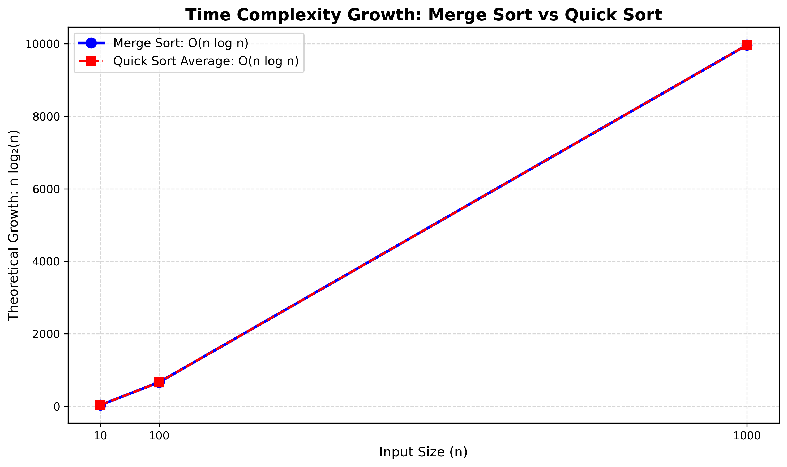

# SortingVisualizer

A Python-based project that visualizes and compares the theoretical time complexity growth of Merge Sort and Quick Sort.

## Project Details

* **Project Name:** SortingVisualizer
* **Topic:** Line Chart Showing Growth Rates
* **Algorithms:** Merge Sort and Quick Sort
* **Input Sizes:** 10, 100, 1000
* **Language:** Python

## Objectives

* Understand the logic of Merge Sort and Quick Sort.
* Compare their theoretical time complexity.
* Visualize growth rates using a line chart.
* Understand why both algorithms have O(n log n) average-case complexity.

## Algorithms and Complexity

| Algorithm  | Best Case  | Average Case | Worst Case |
| ---------- | ---------- | ------------ | ---------- |
| Merge Sort | O(n log n) | O(n log n)   | O(n log n) |
| Quick Sort | O(n log n) | O(n log n)   | O(n²)      |

## Visualization

The project generates a line chart comparing the theoretical growth of Merge Sort and Quick Sort average case for input sizes 10, 100, and 1000.



Both curves overlap because their average-case growth function is n log2(n).

**Note:** The chart represents theoretical growth values, not measured execution times.

## Project Files

* `SortingComplexity.py` – Python program that generates the chart.
* `Algorithm.md` – Algorithm logic and pseudocode.
* `Explanation.md` – Explanation of the algorithms and visualization.
* `Prompt.txt` – Prompt used to guide the visualization.
* `Visualization.png` – Generated line chart.
* `requirements.txt` – Required Python libraries.

## Requirements

* Python 3
* matplotlib
* mplcursors

## How to Run

1. Download or clone this repository.

2. Open the project folder in VS Code.

3. Install the required libraries:

   ```bash
   python -m pip install -r requirements.txt
   ```

4. Run the program:

   ```bash
   python SortingComplexity.py
   ```

5. The line chart will be displayed and saved as `Visualization.png`.

## Conclusion

This project demonstrates the theoretical growth rates of Merge Sort and Quick Sort. Both have O(n log n) average-case time complexity, while Quick Sort can have O(n²) time complexity in the worst case.
